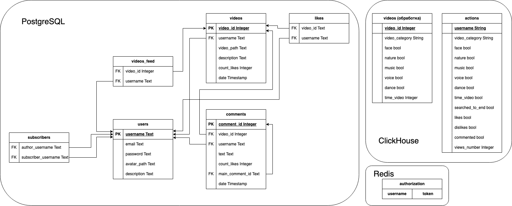

# TikTok

## Тема и целевая аудитория

<B>ТикТок</B> представляет собой сервис, который предназначен для создания и просмотра видеороликов небольшого размера.

### MVP

1. Публикация видео
2. Просмотр ленты
3. Сбор статистики (Пропуски/оценка/комментарии)

### Целевая аудитория

По состоянию на 2023 год <ins>MAU</ins> =  1.1 млрд [^1]. 

Распределение по странам
Страна | Подключены пользователей (млн)
:---  | :---:
США | 140.58
Индонезия | 106.9
Бразилия | 74
Россия | 56.31
Мексика | 51.27
Вьетнам | 49.59
Филиппины | 42.75
Таиланд | 39.5
Турция | 30.83
Саудовская Аравия | 25.2
Пакистан | 25.15
Великобретания | 23.82
Египет | 22
Ирак | 20.68
Франция | 19.74

## Расчет нагрузки

По состоянию на 2023 год <ins>DAU</ins> = 600 млн [^2].

Я провела 10 минут на сайте, чтобы выяснить, какие запросы за этот период были отправлены.

Получилось, что за 10 минут было отправлено **2039** запросов(161 МБ), из них 50 запросов за видео(125 МБ).

Среднее время пользования приложением за день (на 2023 год) = 95 мин [^3].

Будем расчитывать нагрузку с расчетом на 5 лет [^4].

### Публикация видео

#### Продуктовые метрики

Исходя из данных, можно сделать вывод, что средний размер скачиваемого видео: 125 МБ / 50 = 2.5 МБ. За день пользователи загружают 34 млн видео [^5].

Средний месячный размер хранилища пользователя равен:

```
2.5 МБ * (34 млн видео / 600 млн пользователей) * 30 дней = 4.25 МБ.
```

Значит, <ins>средний размер хранилища пользователя</ins>:

```
4.25 МБ * 12 месяцев * 5 лет = 255 МБ / 1024 = 0.25 ГБ
```

<ins>Среднее количество действий пользователя в день</ins>:

```
34 млн видео / 600 млн пользователей = 0.06 видео
```

#### Технические метрики

При загрузке одного моего видео в TikTok пришлось до 350 запросов (6.1 МБ) и около 1 минуты.

Таким образом, <ins>среднее количество запросов в секунду</ins> равно:

```
350 / (1 * 60) * 34000000 / (24 * 60 * 60) = 2295 RPS
```

<ins>Размер хранения</ins> публикаций видео:

```
0.25 ГБ * 600 млн человек / 1024 = 146484 Тб
```

Максимальный размер видео в тикток может быть 287.6 МБайт [^6]. 
<ins>Пиковое потребление в течении суток</ins>. Трафик по часам распределяется равномерно, потому что пользователи из разных часовых поясов, поэтому средний трафик от пикового не отличается, поэтому возьмем небольшой коэфицент k=1.5, на который умножим этот средний трафик, и получим пиковый:

```
(287.6 * 8 / 1000 / 1000) Тбит * 34 млн/д / (24 * 60 * 60) * 1.5 = 1.3581 Тбит/с
```

<ins>Суммарный суточный</ins> трафик (объем данных, передающихся через сети за сутки):

```
34 млн/д * 2.5 МБ / 1024 = 83008 Гбайт/д
```

### Просмотр ленты

#### Продуктовые метрики

<ins>Средний размер хранилища пользователя</ins> довольно незначительный: хранить идентификаторы пользователя и просмотренные им видео, поэтому учитывать этот размер не будем.

За 10 минут было просмотрено максимально 50 видео, в среднем будет 0.5 * 50 = 25 видео. Отсюда <ins>среднее количество действий пользователя в день</ins>:

```
25 / 10 * 95 = 237 действий/день
```

#### Технические метрики

<ins>Размер хранения</ins> не учитываем из-за незначительных данных.

<ins>Среднее количество запросов в секунду</ins> равно:

```
2039 / (10 * 60) * 600 000 000 / (24 * 60 * 60) ≈ 23600 RPS
```

За 10 минут постоянно листая в среднем получается 300 МБ на все запросы для просмотра ленты.

<ins>Пиковое потребление в течении суток</ins>. Трафик по часам распределяется равномерно, потому что пользователи из разных часовых поясов, поэтому средний трафик от пикового не отличается, поэтому возьмем небольшой коэфицент k=1.5, на который умножим этот средний трафик, и получим пиковый:

```
((((300 МБ / (10 * 60) секунд) Мбайт/с * 8 / 1000 / 1000) Тбит/с * (95 * 60) c) Тбит * 600 млн/д) Тбит/д / (24 * 60 * 60) Тбит/с * 1.5 = 237.45 Тбит/с
```

<ins>Суммарный суточный трафик</ins>:

```
((161 МБ / (10 * 60)) МБ/с / 1024 Гб/c * (95 * 60 c/д)) Гб/д * 600млн = 896191406 Гбайт/день
```

### Сбор статистики (Пропуски/оценка/комментарии)

#### Продуктовые метрики

Каждый просмотр видео - это сбор статистики по этому видео. <ins>Среднее количество действий пользователя в день</ins> 237.

Статистика нужна для формирования ленты. Можно построить гипотизу, что для анализа статистики нужно хранить:
- входные данные:
    - айдишник пользователя = 8 байт
    - айдишник видео = 8 байт
    - время просмотра = 4 байта
    - флаг досмотра видео до конца = 1 байт
- выходные данные:
    - лайкнул ли = 1 байт
    - дизлайкнул ли = 1 байт
    - прокомментировал ли = 1 байт
    - количество просмотра данного видео = 4 байта
Итого на одну запись сохраняется 28 байт

Значит, <ins>средний размер хранилища пользователя</ins>:

```
28 байт * 237 действий/день * 30 дней * 12 месяцев * 5 лет / 1024 / 1024 / 1024 = 0.011 Гб
```

#### Технические метрики

<ins>Размер хранения</ins> статистики:

```
0.011 Гб * 600 млн человек / 1024 = 6445.31 Тб
```

За 10 минут постоянно листая в среднем получается 120 видео на все запросы для просмотра ленты. Это (120 / 10) действий/мин * 95 мин/день = 1140 действий в день пиково.

<ins>Пиковое потребление в течении суток</ins>. Трафик по часам распределяется равномерно, потому что пользователи из разных часовых поясов, поэтому средний трафик от пикового не отличается, поэтому возьмем небольшой коэфицент k=1.5, на который умножим этот средний трафик, и получим пиковый:

```
(28 байт * 8 / 1000 / 1000 / 1000 / 1000) Тбит * 1140 действий/день * 600 млн / (24 * 60 * 60) * 1.5 = 0.0027 Тбит/с
```

<ins>Суммарный суточный трафик</ins>:

```
28 байт * 237 действий/день * 600 млн / 1024 / 1024 / 1024 = 3708.16 Гбайт/д
```

<ins>Среднее количество запросов в секунду</ins> равно:

```
237 * 600 000 000 / (24 * 60 * 60) ≈ 1645833 RPS
```

### Сводная таблица

Продуктовые метрики
Тип разбивки | Средний размер хранилища пользователя (ГБайт) | Среднее количество действий пользователя в день
:--- | :---: | :---:
Публикация видео | 0.25 | 0.06
Просмотр ленты | – | 237
Сбор статистики | 0.011 | 237

Технические метрики
Тип разбивки | Размер хранения (Тб) | Пиковое потребление в течении суток (Тбит/с) | Суммарный суточный (Гбайт/д) | RPS
:--- | :---: | :---: | :---: | :---:
Публикация видео | 146484 | 1.3581 | 83008 | 2295
Просмотр ленты | – | 237.45| 896191406 | 23600
Сбор статистики | 6445.31 | 0.0027 | 3708.16 | 1645833

## Глобальная балансировка нагрузки

### Физическое расположение ДЦ

Исходя из географии аудитории представленной в таблице распределения по странам, можно сделать вывод, что большая часть аудитории приходится на Северную Америку, поэтому там необходимо разместить достаточное количество ДЦ. Датацентры будут распологаться в США, прежде всего в крупных городах:
- Нью-Йорк
- Сан-Франциско
- Сиэтл
- Даллас

На Бразилию приходится также большая часть пользователей. Располагаем ДЦ в следующих местах:
- Сан-Паулу
- Буэнос-Айрос

На Европу приходится процента пользователей, причем пользователи равномерно распределены по всей территории. Поэтому расположение будет следующим:
- Лондон (северная Европа)
- Франкфурт (средняя и восточная Европа)
- Цюрих (центральная Европа)
- Париж (западная Европа)
- Стокгольм (северная Европа и Россия)
- Мадрид (южная Европа)
- Хельсинги (северо-восточная Европа)

Индия тоже входит в топ по количеству пользователей. Будет хорошим решением расположить ЦОДы в следующих городах:
- Нью Дели
- Мумбаи

Индонезия и Россия покрывается индийскими и европейскими датацентрами.

Так как в Африке нет большого количества пользователей, то этому региону будет достаточно расположить 1 датацентр в городе Йоханнесбург, тк он находится на Юге Африки, для которой Европейские сервера будут отвечать дольше, чем для Северной.

Добавление Токио будет покрывать Восточную Азию и Дальний Восток России.

Для покрытия центральной России достаточно будет ДЦ в Москве.

Для покрытия Австалии нужен ДЦ в Сидней.

#### Схема расположения ДЦ


### Принцип балансировки GeoDNS
Определения ДЦ для обработки запроса будет осуществляться с помощью GeoDNS. DNS-сервер Bind предоставляет возможность использовать базу данных GeoIP2 для определения географического положения клиента. Таким образом, DNS сервер используя GeoIP, будет предоставлять различные IP-адреса в ответ на запросы от клиентов в зависимости от их физического местоположения.

## Локальная балансировка нагрузки

### Путь запроса до сервера
Датацентр определяется по расположению клиента, используется GeoDNS. 
После того как запрос дошел до датацентра, запрос распределяется в конкретный физический сервер Nginx, здесь мы используем Virtual Server via Direct Routing. Nginx обновляет хосты для обращения в Back, используя Nginx Upstream Modules.

### CDN
CDN сервера используются для быстрой доставки контента до клиентов. Сервера располагает рядом с датацентрами так, чтобы каждый сервер CDN обращался за обновлением данных к ближайшему датацентру. 

### L3 балансировка
Для повышения доступности и надежности системы используем VIP, ретранслирующий запросы на физические сервера через Direct Routing.

### L7 балансировка
#### Nginx
Nginx сервера с модулем Nginx Upstream Modules балансируют запросы на бекэнд сервера.
Хосты обновляются через Service Discovery

В качестве Service Discovery используется Consul.

#### Sidecar
В качестве Sidecar используется Istio
Балансировка запросов между подами происходит автоматически в рамках Kubernetes.

### Схема отказоустойчивости и балансировки нагрузки


## Логическая схема БД


## Физическая схема БД



### Сводная таблица
Тип | Значение
:--- | :---:
Выбор СУБД | PostgeSQL – для основной бизнес-логики, ClickHouse – для аналитики
Индексы | users.username, comments.video_id, subscribers.author_username, videos.username, videos_feed.username, likes.video_id, likes.username
Шардинг | по username
Денормализация | Дублирование метаданных о видео в бд ClickHouse

### Привязка к конкретной Базе Данных

Для хранения основных данных TikTok в качестве СУБД подойдет PostgreSQL для каждой таблицы. Список таблиц, полей и связей между ними представлены в пункте 5.

Для хранения аналитических данных нам понадобится ClikHouse с таблицами videos (обработка), actions.

Для хранения авторизации лучше всего подойдет Redis.

### Индексы

#### хэш-индекс для поля username таблицы users
Данный индекс необходим для регистрации/авторизации, когда нужно проверить, есть ли такой username в БД.

#### хэш-индекс для поля video_id таблицы comments
Данный индекс необходим для поиска комментариев по video_id, когда нужно быстро получить комментарии под видео.

#### хэш-индекс для поля author_username таблицы subscribers
Данный индекс необходим для поиска подписчиков для author_username, когда нужно быстро получить подписчиков для пользователя.

#### хэш-индекс для поля username таблицы videos
Данный индекс необходим для поиска видео для username, когда нужно быстро получить видео в профиль пользователя.

#### хэш-индекс для поля username таблицы videos_feed
Данный индекс необходим для поиска видео для username, когда нужно быстро сформировать ленту рекомендаций для пользователя.

#### хэш-индекс для поля video_id таблицы likes
Данный индекс необходим для поиска лайков для видео, когда нужно быстро получить количество лайков под видео.

#### хэш-индекс для поля username таблицы likes
Данный индекс необходим для поиска лайков для пользователя, когда нужно быстро получить лайкнутые видео пользователя.

### Шардирование и резервирование СУБД. Схема резервного копирования.

На каждом из 18 физическом сервере мы настроим 50 сегментов для осуществления процесса виртуального разбиения данных. В качестве ключа разбиения используем username – это уникальный идентификатор пользователя.

Для целей резервного копирования на каждом из дата-центров установим одну вторичную базу данных. В случае сбоя основной базы, эта вторичная база принимает на себя роль основной, управляя данными пользователей. Резервные данные регулярно экспортируются на внешний накопитель. Необходимо разработать алгоритм, который будет объединять резервные копии с различных серверов баз данных.

### Таблица `users`
| Название поля       | Тип данных | Размер (байты) |
|---------------------|------------|----------------|
| username            | varchar    |       16       |
| email               | varchar    |       16       |
| password            | bytes      |       16       |
| avatar_path         | varchar    |       16       |
| description         | varchar    |       256      |
| **Итого за запись** |            |     **320**    |

### Таблица `videos`
| Название поля       | Тип данных | Размер (байты) | 
|---------------------|------------|----------------|
| video_id            | uuid       |       16       |
| username            | varchar    |       16       |
| video_path          | varchar    |       16       |
| description         | varchar    |       256      |
| count_likes         | uuid       |       16       |
| date                | uuid       |       8        |
| **Итого за запись** |            |     **328**    |

### Таблица `videos_feed`
| Название поля       | Тип данных | Размер (байты) |
|---------------------|------------|----------------|
| video_id            | uuid       |       16       |
| username            | varchar    |       16       |
| **Итого за запись** |            |     **32**     |

### Таблица `likes`
| Название поля       | Тип данных | Размер (байты) |
|---------------------|------------|----------------|
| video_id            | uuid       |       16       |
| username            | varchar    |       16       |
| **Итого за запись** |            |     **32**     |

### Таблица `comments`
| Название поля       | Тип данных | Размер (байты) |
|---------------------|------------|----------------|
| comment_id          | uuid       |       16       |
| video_id            | uuid       |       16       |
| username            | varchar    |       16       |
| text                | varchar    |       256      |
| count_likes         | uuid       |       16       |
| main_comment_id     | uuid       |       16       |
| date                | varchar    |       8        |
| **Итого за запись** |            |     **344**    |

### Таблица `subscribers`
| Название поля       | Тип данных | Размер (байты) |
|---------------------|------------|----------------|
| author_username     |   varchar  |       16       |
| subscriber_username |   varchar  |       16       |
| **Итого за запись** |            |     **32**     |

### Таблица `videos` (обработка)
| Название поля       | Тип данных | Размер (байты) |
|---------------------|------------|----------------|
| video_id            | uuid       |       16       |
| username            | varchar    |       16       |
| text                | varchar    |       256      |
| count_likes         | uuid       |       16       |
| main_comment_id     | uuid       |       16       |
| date                | varchar    |       8        |
| **Итого за запись** |            |     **344**    |

Для расчета объема памяти, необходимого для хранения данных в базе данных социальной сети, были использованы следующие предпосылки и методология:

### Количество пользователей
База данных должна обслуживать 1.1 миллиарда пользователей.

### Количество записей
- **Таблица `videos`**: Для каждого пользователя предполагается наличие 10 записей.
- **Таблица `videos_feed`**: Для каждого пользователя хранится 100 записей.
- **Таблица `likes`**: Каждый пользователь ставит минимум 10 лайков.
- **Таблица `comments`**: Каждый пользователь оставляет 10 комментариев.
- **Таблица `subscribers`**: В среднем каждый пользователь имеет 100 подписчиков.

### Сводная таблица расчетных размеров для хранения данных

| Таблица       | Расчетный размер для хранения (байты) | Расчетный размер для хранения (ГБ) | Расчетный размер для хранения (ТБ) |
|---------------|---------------------------------------|------------------------------------|------------------------------------|
| `users`       | 88,000,000,000                        | ~81.9                              | ~0.08                              |
| `videos`      | 3,344,000,000,000                     | ~3,110.7                           | ~3.11                              |
| `videos_feed` | 3,520,000,000,000                     | ~3,278.4                           | ~3.28                              |
| `likes`       | 352,000,000,000                       | ~327.7                             | ~0.33                              |
| `comments`    | 3,344,000,000,000                     | ~3,110.7                           | ~3.11                              |
| `subscribers` | 3,520,000,000,000                     | ~3,278.4                           | ~3.28                              |

Обратите внимание, что указанные размеры являются приблизительными и округлены до ближайшего десятичного знака. Реальные значения могут незначительно отличаться в зависимости от системы хранения данных.


Используя эти данные, мы провели расчеты для определения необходимого объема памяти для каждой таблицы, что позволяет оценить требуемые масштабы хранилища данных.


## Алгоритмы

### Формирование рекомендаций

Алгоритм формирования рекомендаций будет состоять из нескольких ключевых шагов:

1. Сбор данных
- Каждый раз, когда пользователь пролистывает пачку видео, отправляются на сервер их данные: ``username``, ``video_id``, ``searched_to_end``, ``liked``, ``disliked``, ``commented``, ``views_number``.
- Из таблицы с метаданными видео, полученными при обработке, берутся по ``video_id`` данные: ``video_category``, ``face``, ``nature``, ``music``, ``voice``, ``dance``, ``time_video``.
2. Запись данных
- Сохранение данных: данные, полученные от клиента и метаданные каждого видео, записываются в ClickHouse.
- Отправка данных на обработку: Отправка пачки вышеупомянутых данных пользователя брокеру сообщений для последующей обработки машинным интелектом.
3. Анализ данных
- Генерация рекомендаций: Модель предсказывает, какие видео из вариантов, которые модели сохраняли при публикации видео и удаляли при удалении видео, могут заинтересовать пользователя, на основе его полученных взаимодействий.
- Сохранение данных: Полученные ``video_id`` брокер сообщений записывает в БД PostgreSQL в таблицу ``videos_feed`` для этого ``username``.
5. Постоянное обновление и оптимизация
- Постоянное обновление рекомендаций: Фоновое дополнение рекомендаций для каждого ``username`` из таблицы с аналитикой действий пользования ``actions``.

### Обработка загружаемых видео

1. Загрузка видео
- Получение файла: Пользователь загружает видео на платформу.
- Проверка формата: Алгоритм проверяет, соответствует ли загруженный файл поддерживаемым форматам (например, MP4, AVI).
2. Отправка видео на сервер
- Загрузка видео на главные сервера CDN и в кластер S3.
2. Предварительная обработка
- Транскодирование: Преобразование видео в стандартный формат и разрешение для обеспечения совместимости и оптимизации производительности.
3. Анализ содержимого
- Детектирование вредоносного и запрещенного контента: Использование алгоритмов машинного обучения для обнаружения неподобающего или нежелательного контента (например, насилия, ненормативной лексики). В случае, если что-то обнаружено, отправка пользователю отказ в загрузке.
- Распознавание лиц и объектов: Анализ видео на предмет наличия лиц, объектов, которые могут быть важны для классификации и рекомендаций для полей ``face``, ``nature``, ``music``, ``voice``, ``dance``.
4. Классификация и тегирование
- Автоматическое тегирование: Назначение категорий ``video_category`` видео на основе его содержимого для улучшения поиска и рекомендаций.
6. Сохранение
- Сохранение видео: Загрузка видео на главные сервера CDN и в кластер S3.
- Сохранение в бд: в базе данных PostgreSQL в таблице ``videos`` с уникальным идентификатором. В базе данных ClickHouse сохранение полученныъ метаданных в таблице ``videos``.

В качестве начальной рекомендации или при нехватке подготовленной информации будут возвращаться наиболее популярные видео, основанные на общем количестве просмотров (``views_number``) и положительных взаимодействиях (``liked``) во всей системе. Это обеспечит начальное вовлечение пользователя, пока не накопится достаточно данных для персонализации.

## Технологии

Используемые технологии
Технология | Область применения | Мотивационная часть
:--- | :---: | :---:
Golang | Язык программирования серверной части | Удобство разработки, маштабируемая бизнес-логика, автоматическая сборка мусора параллельно с программой
Python | ML-задачи | Язык программирования для выполнения задач машинного интелекта
React | Фронтенд-веб | Компонентный подход к верстке
Kotlin | Фронтенд-андроид | Современный язык для разработки андроид-приложений
Swift | Фронтенд-ios | Современный язык для разработки ios-приложений
Jaeger | Система трессировки | Распространенная система для сбора и отображения данных трейсов
Prometheus+Grafana | Система сбора и отображения статистики по запросам | Удобная система для мониторинга запросов
Kubernetes | Деплой | Масштабирование, отказоустойчивость, утилизация ресурсов
GitLab | Система контроля версий, командная разработка, CI/CD | Распространенная система контроля для компаний
Redis | Кэш данных/запросов | Хранение данных в оперативной памяти для быстрого доступа
S3 | Хранение статического контента	| Стандартный протокол облачного хранения
PostgreSQL | Хранение данных | Современная РСУБД
ClickHouse | Хранение аналитики | Быстрая колончатая БД
RabitMQ | Брокер сообщений | Отказоустойчивая обработка сообщений
Nginx | L7 балансировка	| Простая настройка, высокая производительность
Istio | Service Mesh для микросервисов | Автоматическое управление трафиком, балансировка нагрузки, маршрутизация, отказоустойчивость

## Обеспечение надежности

### Своевременное выявление проблем в работе приложения
Сбор метрик, отображаемых в Grafana, и отправка алертов, помогают своевремнно выявить проблемные места в коде, например долгое выполнение определенных запросов поможет заострить внимание на анализе пути запроса и ускорении запроса.

### Бесшовное обновление
Бесшовное обновление поможет вливать изменение, не сбивая работу приложения.

### Хранение версий приложения
Хранение версий приложения поможет откатывать релизы, в которых были допущены ошибки.

### Механизмы резервирования и путь запроса

#### Определение Дата-центра
При выполнении запроса DNS-сервер отдает IP-адрес ближайшего дата-центра. В случае неполадок в одном из дата-центров его адрес убирается из DNS-сервера, и запросы будут балансироваться в другие дата-центра.

#### Балансировка внутри Дата-центра
В ДЦ установлена L3 балансировка VIP via Direct Routing, что обеспечивает надежность работы сервера в рамках дата-центра.
При падении одного из балансировщиков, он снимается из нагрузки, всё это происходит автоматизированно посредством ServiceDiscovery.
Принцип балансировки: N+1

#### Резервирование ServiceDiscovery
Consul поднимается в нескольких экземплярах в одном кластере с использованием протокола обмена данных gossip.
Если один из серверов Consul упадет, остальные серверы в кластере продолжат работу, обеспечивая непрерывность сервиса.

#### Sidecar и сервисы Kubernetes
Istio управляет трафиком микросервисов в Kubernetes и обеспечивает их надежность.


### Резервирование PostgreSQL и Redis
В PostgreSQL используем механизм репликации master-slave, а также периодическое резервное копирование данных.

Redis-кластер гарантирует надежность благодаря репликации master-slave с тремя slave.

### Отказоустойчивость 

Наличие нескольких серверов поможет в случае сбоя одного из них переключить клиентов на другой.

Наличие реплик поможет востановить данные и продолжить работу бесперебойно в случае неисправности с мастером БД.

В случае падения брокера сообщений, сообщения не потеряются, так как будут сохранены на внутреннем накопителе.

### Защита от DDos-атак

При помощи кэширования данных и понимания, какой пользователь делает запрос: по ip-адресу или по username, например, можно ограничить количество определенных запросов для каждого такого пользователя.

## Схема проекта


### sidecar - Istio
1. Управление Трафиком: Istio предоставляет динамическое управление потоком трафика и маршрутизацию для микросервисов. Это позволяет более гибко настраивать как трафик входит и выходит из вашей системы.

2. Безопасность: Istio усиливает безопасность микросервисов, предоставляя важные функции, такие как взаимное шифрование трафика, управление идентификацией и политиками доступа.

3. Наблюдаемость: Он предоставляет детальную информацию о работе микросервисов, включая мониторинг, логирование и трассировку запросов. Это помогает быстро находить и устранять проблемы.

4. Надёжность: Istio увеличивает надёжность системы через функции типа повторных попыток, переключения на резервные копии и ограничение потоков, что помогает обеспечить стабильное функционирование даже при сбоях в отдельных сервисах.

### ClickHouse
Clickhouse используется для хранения пользовательского поведения и данных видео, которые были получены при загрузке видео. 
Это нужно для быстрого получение информации пользовательского поведения и предоставления рекомендаций

### RabbitMQ
RabitMQ нужно для очереди сообщений обработки  загружаемого видео, а также для предоставления рекомендации пользователю

### Redis
Помимо авторизации Redis нужен для реализации распределенного ratelimiter-a запросов в определенный временной промежуток
## Расчет ресурсов

| Сервер            | Количество серверов | Процессор                | Ядра | Оперативная память | Долговременная память | Приблизительная стоимость за единицу | Пропускная способность (Гбит/с) |
|-------------------|---------------------|--------------------------|------|--------------------|-----------------------|-------------------------------------|---------------------------------|
| PostgreSQL        | 900                 | Intel Xeon Platinum 8280 | 28   | 128 ГБ             | 4 ТБ                  | $10,000                             | 0.9054                           |
| Авторизация       | 20                  | AMD Ryzen 9 5950X        | 16   | 32 ГБ              | 1 ТБ                  | $3,000                              | 6.7905                           |
| Комментарии/Лайки | 30                  | AMD Ryzen 9 5950X        | 16   | 32 ГБ              | 1 ТБ                  | $3,000                              | 6.7905                           |
| Загрузка видео    | 50                  | AMD Ryzen 9 5950X        | 16   | 64 ГБ              | 2 ТБ                  | $4,000                              | 4.0743                           |


## Список источников:
[^1]: [MAU](https://www.demandsage.com/tiktok-user-statistics/#:~:text=1.1%20billion%20are%20its%20monthly%20active%20users%20as%20of%202023)
[^2]: [DAU](https://www.demandsage.com/tiktok-user-statistics/#:~:text=11.%20How%20Much%20Time%20Do%20TikTok%20Users%20Spend%20On%20The%20Platform%3F)
[^3]: [Среднее время пользования в день](https://www.theverge.com/interface/2020/6/10/21285309/tiktok-2020-user-numbers-revenue-smash-hit-mea-culpa)
[^4]: [Статистика роста регистрации в TikTok с 2017 года](https://www.demandsage.com/tiktok-user-statistics/#:~:text=at%201.677%20billion.-,Here%20is%20a%20table%20showing%20TikTok%E2%80%99s%20Users%20Over%20the%20years%3A,-Year)
[^5]: [Среднее количество загрузки видео в TikTok в день](https://techjury.net/blog/how-many-videos-are-uploaded-to-tiktok-daily/#:~:text=34%20million%20videos%20posted%20on%20Tiktok%20daily)
[^6]: [Максимальный размер видео](https://www.anyrec.io/ru/tiktok-video-size/#:~:text=%D0%94%D0%BB%D1%8F%20%D1%83%D1%81%D1%82%D1%80%D0%BE%D0%B9%D1%81%D1%82%D0%B2%D0%B0%20iOS%20%D0%B2%D1%8B%20%D0%BC%D0%BE%D0%B6%D0%B5%D1%82%D0%B5%20%D0%B7%D0%B0%D0%B3%D1%80%D1%83%D0%B7%D0%B8%D1%82%D1%8C%20%D0%B2%D0%B8%D0%B4%D0%B5%D0%BE%20%D1%81%20%D1%80%D0%B0%D0%B7%D0%BC%D0%B5%D1%80%D0%BE%D0%BC%20%D1%84%D0%B0%D0%B9%D0%BB%D0%B0%20287%2C6%20%D0%9C%D0%91)
[^7]: [Регионы по популярности](https://inclient.ru/tiktok-stats/#auditoria-tiktok-v-2023-godu:~:text=%D0%A1%D0%B0%D0%BC%D1%8B%D0%B9%20%D0%B2%D1%8B%D1%81%D0%BE%D0%BA%D0%B8%D0%B9%20%D0%BE%D1%85%D0%B2%D0%B0%D1%82%20%D0%BF%D0%BE%D0%BB%D1%8C%D0%B7%D0%BE%D0%B2%D0%B0%D1%82%D0%B5%D0%BB%D0%B5%D0%B9%20TikTok%20%D0%BD%D0%B0%D0%B1%D0%BB%D1%8E%D0%B4%D0%B0%D0%B5%D1%82%D1%81%D1%8F%20%D0%B2%20%D0%A1%D0%B0%D1%83%D0%B4%D0%BE%D0%B2%D1%81%D0%BA%D0%BE%D0%B9%20%D0%90%D1%80%D0%B0%D0%B2%D0%B8%D0%B8%20(99.6%25)%2C%20%D0%9E%D0%90%D0%AD%20(97.7%25)%20%D0%B8%20%D0%9A%D1%83%D0%B2%D0%B5%D0%B9%D1%82%D0%B5%20(91.3%25).%20%D0%A1%D0%A8%D0%90%20%D0%B7%D0%B0%D0%BD%D0%B8%D0%BC%D0%B0%D0%B5%D1%82%2020%2D%D0%B5%20%D0%BC%D0%B5%D1%81%D1%82%D0%BE%20%D0%BF%D0%BE%20%D0%BE%D1%85%D0%B2%D0%B0%D1%82%D1%83%20%D0%B2%20TikTok%20(55%25).%20%D0%94%D0%BB%D1%8F%20%D1%81%D1%80%D0%B0%D0%B2%D0%BD%D0%B5%D0%BD%D0%B8%D1%8F%2C%20%D0%BE%D1%85%D0%B2%D0%B0%D1%82%20TikTok%20%D0%B2%20%D0%A0%D0%BE%D1%81%D1%81%D0%B8%D0%B8%20%D0%B2%202023%20%D0%B3%D0%BE%D0%B4%D1%83%20%D1%81%D0%BE%D1%81%D1%82%D0%B0%D0%B2%D0%BB%D1%8F%D0%BB%2049.2%25)
